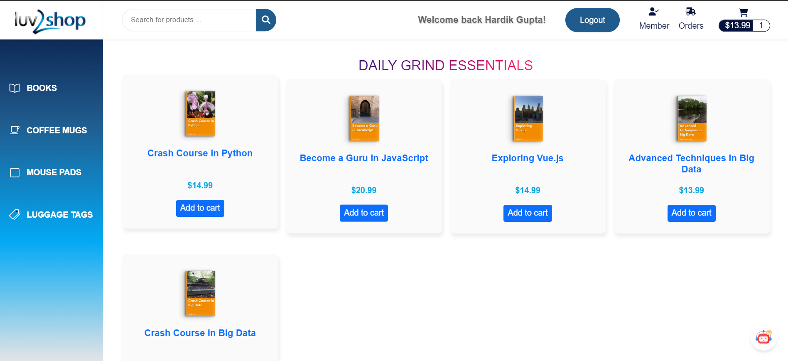
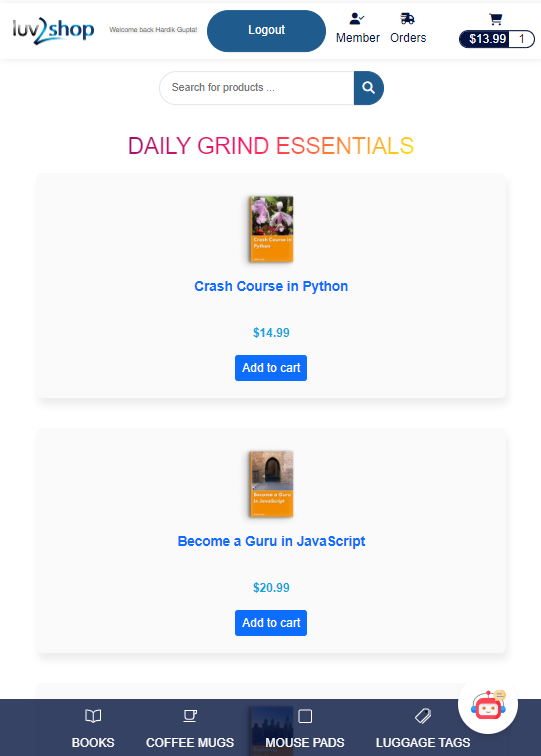
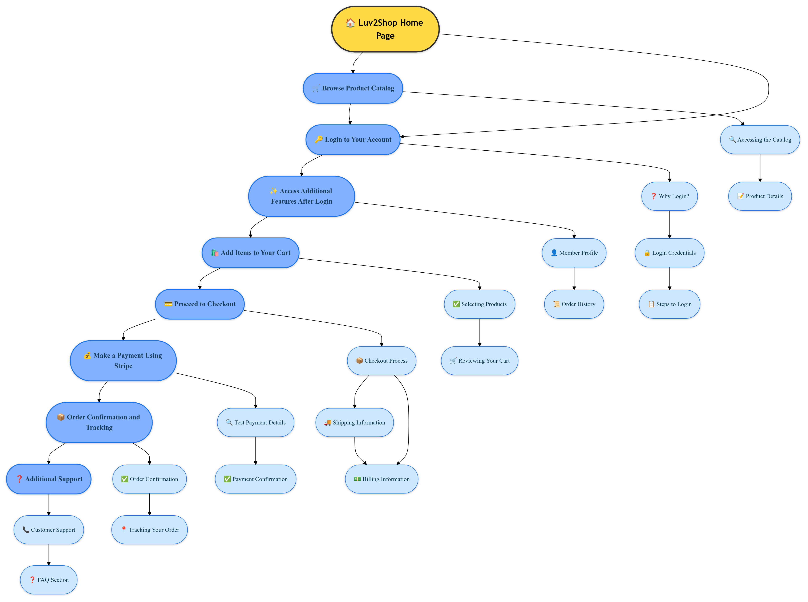
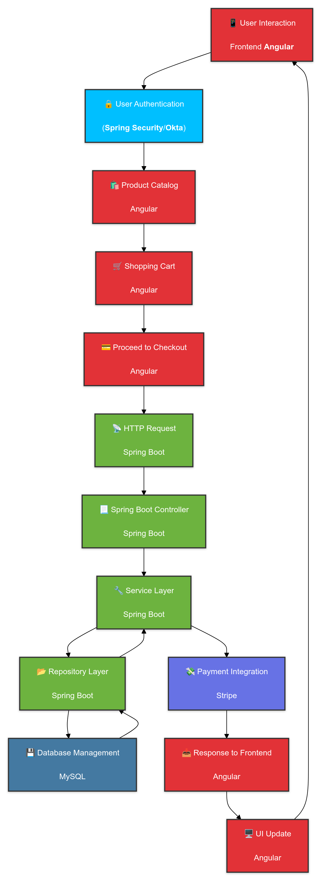

# Full-Stack E-Commerce Application with Angular and Spring Boot

### Desktop View

### Mobile View

### User Interaction Flowchart

A detailed flowchart illustrating the user interaction process on the Luv2Shop website. This visual representation showcases the complete journey a user undergoes while interacting with our e-commerce platform, from browsing products to making a purchase.

### Data and Technology Flowchart

A detailed flowchart that illustrates how data and technology flow through the Luv2Shop website. This visual guide provides a clear understanding of how various components and technologies interact to deliver a seamless user experience.

This repository contains the code for the Full-Stack E-Commerce Website developed as part of the Udemy course ["Full Stack: Angular and Java Spring Boot E-Commerce Website"](https://www.udemy.com/course/full-stack-angular-spring-boot-tutorial/) by [Chad Darby](https://github.com/darbyluv2code).

## Overview

This E-Commerce website, known as **"Luv2Shop,"** is a full-stack application built with Angular and Java Spring Boot. It includes a wide range of features and functionalities necessary for a modern online store. The project is designed to showcase best practices in building robust and secure web applications using the technologies mentioned above.

## Features

- **User Authentication**: Utilizes Spring Security and Okta for secure user authentication and authorization.
- **Product Catalog**: Allows users to browse and search for products with a well-structured product catalog.
- **Shopping Cart**: Users can add products to their cart and proceed to checkout seamlessly.
- **Payment Integration**: Integration with Stripe for handling payments.
- **Luv2Shop ChatBot**: Users can interact with the AI chatbot related to the site.
- **Responsive Design**: Improved styling and responsive design for a better user experience.

## Technologies Used

- Java 22
- Apache Maven
- Hibernate
- Spring Core
- Spring Data
- Spring REST
- Spring Boot
- Spring Security
- TypeScript
- Angular
- Okta
- Stripe
- Generative AI

## Contributions

- **Payment Features Implementation**: Developed and integrated multiple payment functionalities to ensure a smooth and reliable transaction experience for users.
- **AI Chatbot Integration**: Implemented an AI chatbot to enhance user interaction and provide a more engaging and interactive experience on the website.

## Luv2Shop Website Interaction Guide

### 1. Browse the Product Catalog

#### Accessing the Catalog

- You can explore the product catalog without needing to log in.
- Simply visit the homepage of the Luv2Shop website.
- Navigate through different categories and use the search bar to find specific products.

#### Product Details

- Click on any product to view detailed information, including:
  - Product description
  - Price
  - Available sizes and colors
  - Customer reviews and ratings

### 2. Login to Your Account

#### Why Login?

- Logging in allows you to access personalized features such as viewing your profile, order history, and managing your cart.

#### Login Credentials

- Use the following credentials to log in:
  - Email: `hg979084@gmail.com`
  - Password: `Hard@9636`

#### Steps to Login

- Click on the "Login" button located at the top right corner of the homepage.
- Enter your email and password in the provided fields.
- Click the "Submit" button to log in.

### 3. Access Additional Features After Login

#### Member Profile

- Once logged in, click on the "Profile" button to:
  - View and edit your personal information.
  - Change your password.
  - Update your shipping and billing addresses.

#### Order History

- Access the "Orders" section to:
  - View a list of all your past orders.
  - Check the status of current orders.
  - Reorder items from your history.

### 4. Add Items to Your Cart

#### Selecting Products

- While browsing the catalog, click on the "Add to Cart" button for any product you wish to purchase.

#### Reviewing Your Cart

- Click on the "Cart" icon at the top of the page to:
  - Review all items added to your cart.
  - Modify quantities or remove items if necessary.

#### Cart Details

- The cart summary will display:
  - Product name
  - Quantity selected
  - Price per item
  - Total cost

### 5. Proceed to Checkout

#### Checkout Process

- Once you are satisfied with the items in your cart, click on the "Proceed to Checkout" button.
- You will be prompted to enter your shipping and billing information.
- Review your order to ensure all details are correct.

#### Shipping Information

- Enter your address, and choose your preferred shipping method.
- You can also use a saved address from your profile.

#### Billing Information

- Provide your payment details or choose a saved payment method.
- Ensure that your billing address matches the address linked to your payment method.

### 6. Make a Payment Using Stripe

#### Test Payment Details

- For testing purposes, use the following Stripe test card details:
  - **Visa**
    - Card Number: `4242 4242 4242 4242`
    - Expiration Date: Any future date (e.g., 12/25)
    - CVC: Any three-digit number (e.g., 123)
  - **MasterCard**
    - Card Number: `5555 5555 5555 4444`
    - Expiration Date: Any future date (e.g., 12/25)
    - CVC: Any three-digit number (e.g., 123)
  - These test card details simulate a successful payment and allow you to test the payment functionality without making actual charges to a credit card.

#### Payment Confirmation

- After entering the test card details, click on "Submit Payment."
- A confirmation popup will appear, indicating that your payment was successful.

### 7. Order Confirmation and Tracking

#### Order Confirmation

- After placing your order, you will receive a confirmation popup with your order details.
- An email confirmation will also be sent to your registered email address.

#### Tracking Your Order

- Go to the "Orders" section in your account to:
  - View the status of your orders.
  - Track your shipment in real-time.
  - View estimated delivery dates.

### 8. Additional Support

#### Customer Support

- If you encounter any issues or need further assistance:
  - Use the chatbot for quick answers or to connect with customer support.

#### FAQ Section

- Visit our FAQ section for answers to common questions about:
  - Shipping and delivery
  - Returns and refunds
  - Payment methods
  - Account management

## Contact Information

If you have any questions, suggestions, or just want to get in touch, you can reach us at:

- Email: [hg979084@gmail.com](mailto:hg979084@gmail.com)
- LinkedIn: [Hardik Gupta](https://www.linkedin.com/in/hardik-gupta830)

We appreciate your interest and look forward to your contributions and feedback!
